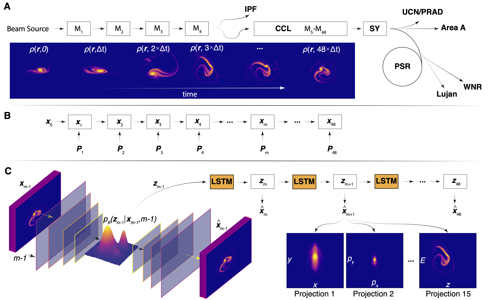
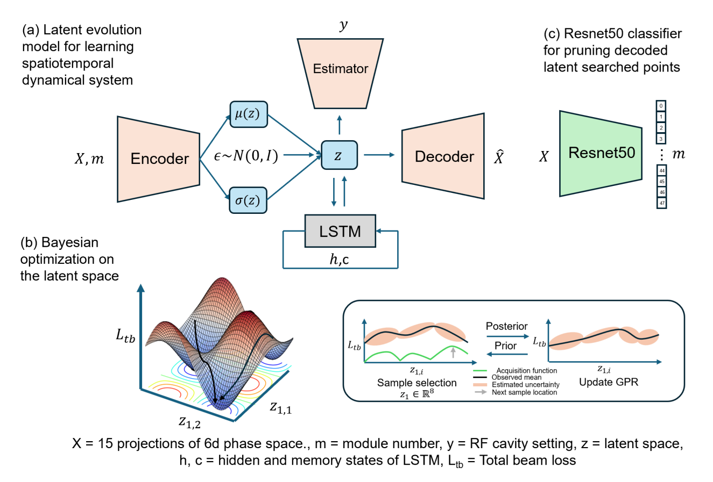
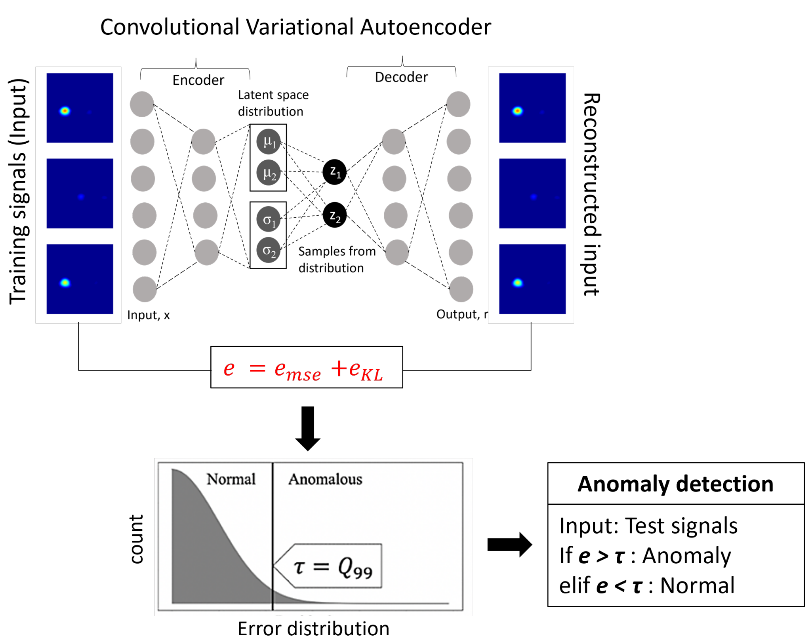
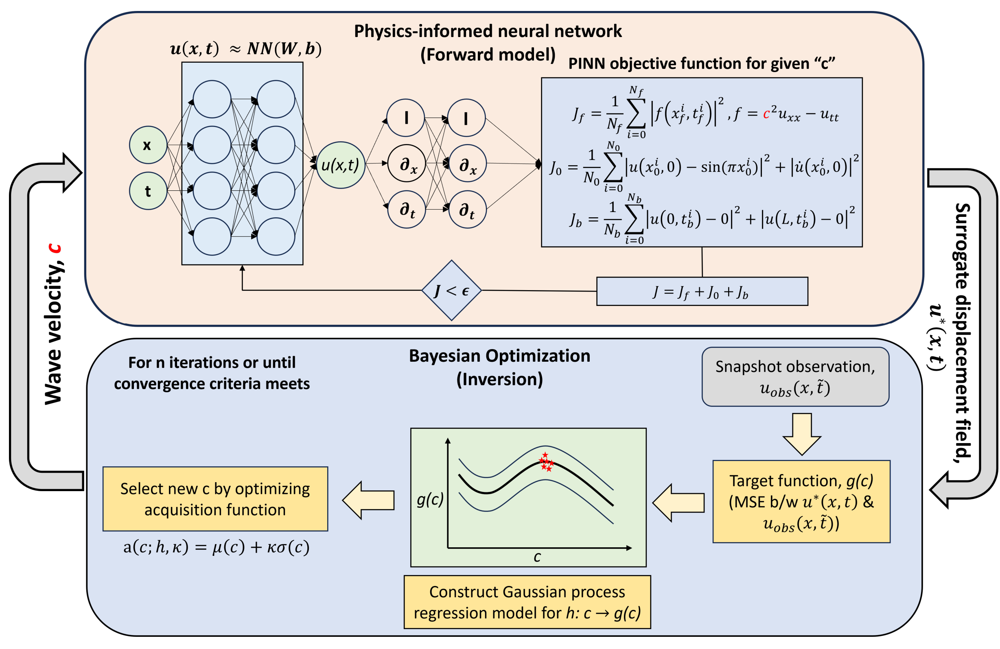
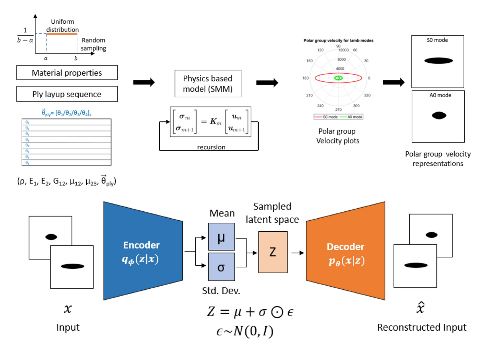
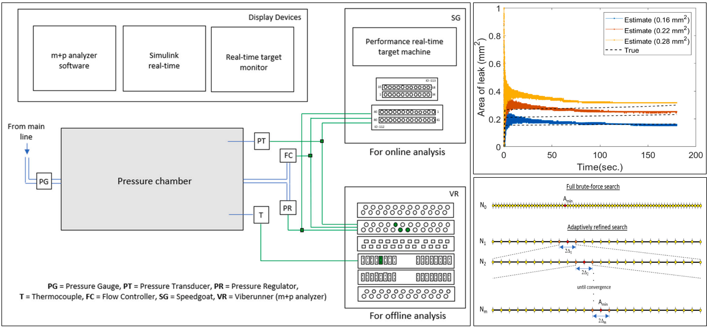
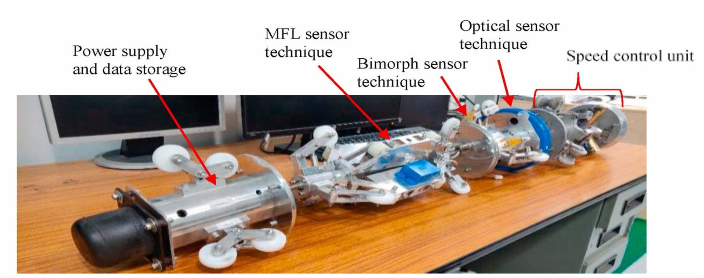

<section class="archive-hero section-tint">
  

    
Scientific machine learning

    <h1>Research projects</h1>
    
Data-driven modeling of spatiotemporal physical systems, with an emphasis on forward, inverse, and optimization problems.

  

</section>

<section class="research-archive section shell" markdown="1">

Latent evolution models

## Spatiotemporal learning of charged-particle beam dynamics (in particle accelerators)
The 6D phase space (x, y, z, px, py, pz) of charged-particle bunches evolves under the influence of electromagnetic fields along the accelerator. This can be viewed as a spatiotemporal dynamical system in which parameters such as RF-cavity amplitude and phase and magnet strength modulate the charged-particle beam.
1. In this [paper](https://www.nature.com/articles/s41598-024-68944-0), we propose a two-step unsupervised deep-learning framework called the *Conditional Latent Autoregressive Recurrent Model (CLARM)* for learning forward spatiotemporal dynamics.
   * The model can generate phase space at various accelerator modules by sampling and decoding the structured latent space representation.
   * The model also forecasts future states (downstream states) of charged particles from past states (upstream states). Learn more on the [project page](https://github.com/lanl/clarm).

  

2. In this [paper](https://arxiv.org/abs/2408.07847), we use a reverse latent evolution model (CLARM is a special case of a broader LEM) to solve the *inverse problem* of predicting 6D phase-space projections across all upstream sections from downstream phase-space measurements.
   * The proposed model also captures the *aleatoric uncertainty* of the high-dimensional input data within the latent space.
   * The uncertainty is propagated through the temporal learner in the latent space to estimate bounds for all upstream predictions, demonstrating robustness to in-distribution variations in the input data.

3. In this [paper](https://arxiv.org/abs/2412.01748), we use a *classifier-pruned Bayesian optimizer* for efficient exploration within a *temporally structured latent space*.
   * CBOL-Tuner adaptively searches and filters the latent space for optimal solutions (i.e., RF settings for minimal beam loss in the accelerator).
   * CBOL-Tuner demonstrates superior performance in identifying multiple optimal settings and outperforms alternative global optimization methods.
  

  

## Structural health monitoring
1. **Out-of-distribution detection/Anomaly detection** in aerospace composites:
   * Collecting datasets that accommodate every possible damage scenario is cumbersome, costly, and often infeasible for aerospace applications.
   * We have proposed two self-supervised representation-learning approaches to learn the distribution of baseline signals.
   * The trained self-supervised learner is used for delamination prediction within an anomaly-detection framework. Methods including autoencoders, variational autoencoders, PCA-SVM, and ICA-SVM are employed.
   * Learn more in [Paper 1](https://www.sciencedirect.com/science/article/pii/S026382232200366X) and [Paper 2](https://arxiv.org/abs/2308.05350).

  

2. **Deep variational filtering** for temperature effects in guided-wave structural health monitoring. Learn more in this [paper](https://www.spiedigitallibrary.org/conference-proceedings-of-spie/11593/1159319/Temperature-compensation-for-guided-waves-using-convolutional-denoising-autoencoders/10.1117/12.2582986.full).
3. **Physical-knowledge-assisted ML** for structural health monitoring. Learn more in this [paper](https://www.sciencedirect.com/science/article/pii/S0041624X2100086X).
4. **Deep surrogate inverse solvers** for guided-wave SHM. Learn more in this [paper](https://www.sciencedirect.com/science/article/pii/S0957417420309234).

## Neural surrogate solvers for PDEs
1. **Physics-informed neural networks + Bayesian optimization** for parameter estimation in PDEs.
   * A PINN is used to solve the partial differential equation (PDE), while *Bayesian optimization (BO)* estimates its parameters.
   * The Bayesian-optimized *physics-informed neural network* estimates the wave velocity associated with a wave-propagation PDE using a single-snapshot observation.
   * The method produces robust predictions in a limited number of iterations across different runs. Learn more in this [paper](https://arxiv.org/abs/2312.14064).

  

## Material design and discovery
1. **Composite material property estimation, composite material generation/discovery**:
  * AI-accelerated property prediction, discovery, and material design have emerged as promising research areas, but comparatively little emphasis has been placed on composite materials.
  * To accelerate and scale prediction, discovery, and design, we propose a deep generative approach for composite materials using *variational autoencoders*.
  * The generator can produce large datasets, reducing the limitations of experiments and simulations.
  * Learn more in [Paper 1](https://ieeexplore.ieee.org/abstract/document/9991053) and [Paper 2](https://www.tandfonline.com/doi/abs/10.1080/15376494.2021.1982090).

  

## Safety of space habitats
1. **Leakage estimation** in conceptual space habitats and pressurized habitat systems using *real-time adaptive optimization*
   * Long-term extraterrestrial habitats must operate under continuous disruptive conditions arising from extreme environments like meteoroid impacts, extreme temperature fluctuations, galactic cosmic rays, destructive dust, and seismic events.
   * Loss of air or atmospheric leakage from a habitat poses safety challenges that demand proper attention. Such leakage may arise from micro-meteoroid impacts, crack growth, bolt/rivet loosening, and seal deterioration.
   * Leakage estimation in deep space habitats is posed as an *inverse problem*. A forward pressure-based dynamical model is formulated for atmospheric leakage.
   * Experiments are performed in a small-scale pressure chamber where different leakage scenarios are emulated and the corresponding pressure values are measured.
   * The EWARS algorithm is developed and validated for the inverse problem of real-time leakage estimation.
   * Learn more in this [paper](https://www.sciencedirect.com/science/article/pii/S0094576522006750).

  

## Robotics
* **Pipe health monitoring robot**: This smart-sensor-based system can be transported inside compressed-gas pipes by a conduit-crawler robot to determine the extent of anomalies in a pipeline. The system comprises a sensor network for anomaly detection, a microcontroller for processing data from the sensor units, a storage unit for the processed data, and an autonomous platform that carries these components through the pipeline. Learn more about the project [here](https://www.iitk.ac.in/smss/projects/phmr/).

  

</section>
