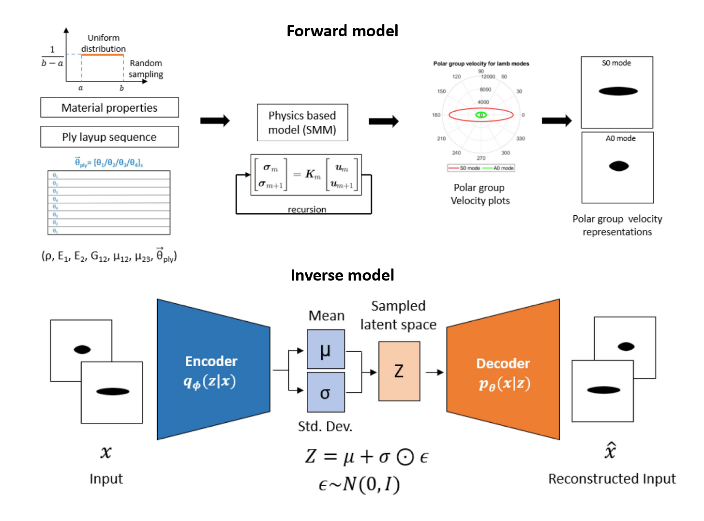

## <ins>Research projects</ins>
## Spatiotemporal learning of charged particles beams dynamics (in particle accelerators)
* 6D phase space(x,y,x,px,py,pz) of charged particle bunches evolves under the influence of EM fields along the accelerator. The problem of can be thought of as a spatiotemporal dynamical sytem, where the system parameters (like amplitude, phase of RF cavity, magnet strenth, etc.) modulates a charged particle beam.
* In [Paper](https://www.nature.com/articles/s41598-024-68944-0), we propose two-step unsupervised deep learning framework named as *Conditional Latent Autoregressive Recurrent Model (CLARM)* for learning the forward spatiotemporal dynamics.
* The model can generate phase space at various accelerator modules by sampling and decoding the structured latent space representation.
* The model also forecasts future states (downstream states) of charged particles from past states (upstream states). More about it on the [project page](https://github.com/lanl/clarm).

  

* In [Paper](https://arxiv.org/abs/2408.07847), we use a reverse latent evolution model (CLARM is a special use case of a more broader LEM) to solve the **inverse problem** of predicting 6D phase space projections across all upstream sections given on downstream phase space measurements as inputs.
* The proposed model also captures the *aleatoric uncertainty* of the high-dimensional input data within the latent space.
* The uncertainity is propagated in the latent space through the temporal learner to estimate the bounds for all upstream predictions, demonstrating the robustness against in-distribution variations in the input data.
  
## Structural health monitoring
1. **Out-of-distribution detection/Anomaly detection** in aerospace composites: Collecting datasets accommodating all possible damage scenarios is cumbersome, costly, and inaccessible for aerospace applications. In this paper, we have proposed two different self-supervised representation learning approaches to learn the distribution of baseline signals. The trained self-supervised learner is used for delamination prediction with an anomaly detection philosophy. We metholdogies like autoencoders, variational autoencoders, PCA-SVM, ICA-SVM are employed. More about this work is available here [Paper-1](https://www.sciencedirect.com/science/article/pii/S026382232200366X), [Paper-2](https://arxiv.org/abs/2308.05350)

  

2. **Deep variational filtering** for temperature effects in guided wave structural health monitoring. More about this work is available here [Paper-1](https://www.spiedigitallibrary.org/conference-proceedings-of-spie/11593/1159319/Temperature-compensation-for-guided-waves-using-convolutional-denoising-autoencoders/10.1117/12.2582986.full)
3. **Physical-knowledge assisted ML** for structural health monitoring. More about this work is available here [Paper-1](https://www.sciencedirect.com/science/article/pii/S0041624X2100086X)
4. **Deep surrogate inverse solvers** for guided wave SHM: More about this work is available here [Paper-1](https://www.sciencedirect.com/science/article/pii/S0957417420309234)

## Neural surrogate solvers for PDEs.
* **Physics-informed Neural Networks + Bayesian-optimization** for parameter estimation of PDEs: PINN is used to solve the partial differential equation (PDE), whereas Bayesian optimization (BO) estimates its parameter. The Bayesian-optimized physics-informed neural network estimates wave velocity associated with wave propagation PDE using a single snapshot observation. We see robust predictions in limited iterations across different runs. More about the work is available here. [Paper1](https://arxiv.org/abs/2312.14064)

  

## AI-accelerated material discovery
* **Composite material property estimation, composite material generation/discovery**: AI-accelerated property prediction, discovery, and design of materials have emerged as a new research front with many promising features. There are many investigations on different materials, but no emphasis is placed on composite materials. Among many challenges, the unavailability of datasets for composite materials is a significant roadblock. This is because conducting multiple experiments is costly and cumbersome, and performing simulations is time-taking and demands computational resources.
* In order to accelerate and scale the prediction, discovery, and design, a deep generation approach is proposed for composite materials. The current research requires limited physical simulations to train a deep generator network. The generator can generate enormous data, eliminating the demerits of both experiments and simulations. The work is novel in terms of the deep generation approach as well as the applications for composite materials. More about this work is here. [Paper-1](https://ieeexplore.ieee.org/abstract/document/9991053), [Paper-2](https://www.tandfonline.com/doi/abs/10.1080/15376494.2021.1982090).

  

## Safety of space habitats
* **Leakage estimation** in concept space habitats/pressurized habitat systems using **real-time adaptive optimization**: Long-term extraterrestrial habitats must operate under continuous disruptive conditions arising from extreme environments like meteoroid impacts, extreme temperature fluctuations, galactic cosmic rays, destructive dust, and seismic events. Loss of air or atmospheric leakage from a habitat poses safety challenges that demand proper attention. Such leakage may arise from micro-meteoroid impacts, crack growth, bolt/rivet loosening, and seal deterioration.
* Leakage estimation in deep space habitats is posed as an **inverse problem**. A forward pressure-based dynamical model is formulated for atmospheric leakage. Experiments are performed on a small-scaled pressure chamber where different leakage scenarios are emulated and corresponding pressure values are measured. An exponentially-weighted adaptively-refined search (EWARS) algorithm is developed and validated for the inverse problem of real-time leakage estimation. [Paper-1](https://www.sciencedirect.com/science/article/pii/S0094576522006750)

  

## Robotics
* **Pipe health monitoring robot**:  The pipe health monitoring system based on smart sensors which can be transported inside compressed gas pipes with the help of a conduit crawler robot to determine the extent of anomalies present in the pipeline. The pipe health monitoring system will comprise a sensor network for anomalies detection, a micro-controller for processing the data from various sensor units and a storage unit to store the processed data, and an autonomous platform or robot, to carry these components inside the pipeline. More about the project is [here](https://www.iitk.ac.in/smss/projects/phmr/).

  

